# Microsoft Entra Privileged Identity Management Lab
 
## Status
 
Complete
 
## Type
 
Identity and Access Management Lab / Privileged Access Management Case Study
 
---
 
## Objective
 
This lab demonstrates how Microsoft Entra Privileged Identity Management (PIM) can reduce standing administrative access by requiring eligible users to activate privileged roles only when needed.
 
The goal was to simulate a realistic just-in-time privileged access workflow for IT support operations, including role eligibility, activation requirements, approval, justification, ticket information, and audit validation.
 
---
 
## Real-World Context
 
This lab simulates the configuration and administrative side of Privileged Identity Management. The activation workflow modeled here mirrors my production experience as a Tier 1 service desk analyst at Logicalis (MSP), where I activated time-bound privileged access daily to support BitLocker recovery requests for a higher-education client. That production experience informed the lab design — particularly the choice of operationally-realistic activation durations, justification and ticket-information requirements, and the use of dedicated service-desk roles (Helpdesk Administrator, Authentication Administrator) rather than broad Global Administrator access.
 
---
 
## Environment
 
- **Platform:** Microsoft Entra ID
- **License:** Microsoft Entra ID P2 Trial
- **Organization (Fictional):** Harborview Health Partners
- **Feature:** Privileged Identity Management
- **Test User:** Mike Iverson
- **Approver:** Configured admin account (lab tenant)
- **Roles Tested:**
  - Helpdesk Administrator
  - Authentication Administrator
---
 
## Lab Scenario
 
Harborview Health Partners wants to reduce standing privileged access for service desk and IAM support staff.
 
Instead of granting permanent administrative rights, selected IT support users are made eligible for privileged roles through Microsoft Entra Privileged Identity Management. When elevated access is needed, the user must activate the role, provide a business justification, include ticket information, satisfy MFA, and receive approval.
 
This lab simulates a service desk support scenario where an analyst requests temporary privileged access to perform an account recovery task after validating the user.
 
---
 
## Roles Onboarded to PIM
 
| Role | Purpose |
|---|---|
| Helpdesk Administrator | Supports service desk tasks such as password reset and user support workflows |
| Authentication Administrator | Supports authentication method and MFA-related account recovery workflows |
 
---
 
## Role Configuration
 
| Role | Assignment Type | Max Activation Duration | MFA Required | Justification Required | Ticket Required | Approval Required | Approver |
|---|---|---|---|---|---|---|---|
| Helpdesk Administrator | Eligible | 8 hours | Yes | Yes | Yes | Yes | GRP-PIM-Approvers |
| Authentication Administrator | Eligible | 4 hours | Yes | Yes | Yes | Yes | GRP-PIM-Approvers |
 
---
 
## Activation Requirement Rationale
 
Each PIM activation requirement was selected to satisfy a specific control objective:
 
- **Multi-factor authentication on activation** — Ensures the activator is the actual eligible user, not someone using stolen credentials. Activation is a higher-trust event than standard sign-in and warrants re-authentication.
- **Justification required** — Creates a documented business reason for every privileged access event. Provides audit evidence that the activation was deliberate, not exploratory or accidental.
- **Ticket information required** — Ties privileged access to a specific work item that can be cross-referenced with the ticketing system. Prevents activations without an associated business task.
- **Approval required (Helpdesk Administrator and Authentication Administrator)** — Even for operational service desk roles, approval by a separate party prevents single-actor privilege escalation. In production environments with high call volume, approval can be scoped to a duty manager or service desk lead to balance security with operational urgency.
The differing activation durations (8 hours for Helpdesk Administrator, 4 hours for Authentication Administrator) reflect the different risk profiles of the roles. Authentication Administrator can manipulate MFA configurations and is therefore higher-risk than Helpdesk Administrator, justifying a shorter activation window.
 
---
 
## Eligible Assignments
 
| User | Role | Assignment State |
|---|---|---|
| Mike Iverson | Helpdesk Administrator | Eligible |
| Mike Iverson | Authentication Administrator | Eligible |
 
---
 
## Activation Workflow Demonstrated
 
Mike Iverson activated the eligible Helpdesk Administrator role through Microsoft Entra PIM end-to-end.
 
| Step | Action | Validation |
|---|---|---|
| 1 | Mike navigates to PIM "My roles" → eligible roles | Helpdesk Admin shown as eligible, not active |
| 2 | Selects Helpdesk Admin → "Activate" | Activation form prompts for MFA, justification, and ticket info |
| 3 | Completes Azure MFA challenge | MFA satisfied; activation form proceeds |
| 4 | Enters ticket reference (HHP-INC-1007) and justification | Required fields completed |
| 5 | Submits activation request | Request enters pending-approval state |
| 6 | Approver receives notification of pending request | (See Approval Workflow section) |
| 7 | After approval, PIM completes role activation | Role transitions from eligible → active |
| 8 | Mike confirms active role status in My Roles | Helpdesk Administrator shown as active with expiration timestamp |
| 9 | Time-bound access expires automatically | Role transitions back from active → eligible |
 
**Justification used:**
"Temporary elevation requested to perform service desk account recovery task for a validated user support case."
 
**Ticket reference:**
HHP-INC-1007
 
---
 
## Approval Workflow Demonstrated
 
The Helpdesk Administrator role was configured to require approval before activation.
 
The activation request was reviewed and approved by the configured approver group. After approval, PIM completed the role activation and Mike Iverson received temporary active access to the Helpdesk Administrator role.
 
**Approval reason used:**
"Approved for time-bound service desk support task after user validation."
 
---
 
## Audit Log Validation
 
PIM audit history was reviewed to validate that every privileged access event was captured in Entra audit logs. Activity types observed across the workflow:
 
- Update role setting — when role configuration was changed
- Add eligible member — when Mike Iverson was made eligible
- Add member to role requested (PIM activation) — when Mike requested activation
- Approve member request (PIM activation) — when the approver approved
- Add member to role completed (PIM activation) — when activation finalized
- Remove member from role (PIM expiration) — when time-bound access expired
All events included initiator identity, target user, target role, timestamp, and request justification, providing complete chain-of-custody documentation for privileged access activity.
 
---
 
## Integration with Access Reviews
 
This lab connects to the Access Review process by showing how eligible privileged access should be reviewed periodically.
 
Eligible assignments such as Helpdesk Administrator and Authentication Administrator should not be granted indefinitely without review. In production, privileged role eligibility should be reviewed on a recurring basis to confirm that users still require the ability to activate those roles.
 
This supports least privilege and helps prevent privilege creep — even on the eligible pool, not just the active pool.
 
---
 
## Security Takeaways
 
- Privileged roles should not be permanently active by default.
- PIM supports just-in-time privileged access, reducing the standing-privilege attack surface.
- Eligible assignments reduce standing administrative privilege without removing the ability to perform privileged tasks when needed.
- MFA, justification, ticket information, and approval together strengthen privileged access workflows by adding identity, intent, traceability, and separation of duties.
- PIM audit logs provide evidence of privileged role assignment and activation activity, supporting forensic and compliance review.
- Service desk and IAM workflows should use task-specific roles (Helpdesk Administrator, Authentication Administrator) instead of broad administrator roles whenever possible.
- Privileged access should be reviewed periodically through access reviews, including review of eligible assignments and not just active ones.
---
 
## What I'd Do Differently in Production
 
- **Use separate dedicated admin accounts** instead of daily user accounts for privileged role activation — keeps day-to-day work and privileged work on different identities.
- **Require approval from an IAM manager, security lead, or service owner** for sensitive roles rather than a generic approver group, ensuring approval is informed.
- **Require ticket numbers for all privileged activations** with downstream cross-referencing against the ticketing system to detect activations without legitimate work items.
- **Use shorter activation windows for higher-risk roles** — Global Administrator and Privileged Role Administrator should have 1–2 hour windows rather than the operational 4–8 hour windows used for service desk roles.
- **Send PIM activation events to a SIEM** for monitoring and alerting, allowing correlation with other identity activity (sign-in risk, conditional access events).
- **Configure alerts for repeated activations, after-hours activations, and high-risk role activations** — patterns that may indicate compromise or misuse.
- **Review eligible assignments on a recurring schedule** (quarterly for high-risk roles, semi-annually or annually for operational roles) to prevent eligible-pool privilege creep.
- **Avoid broad roles when more specific roles can satisfy the task** — least privilege at the role-selection level, not just at the activation level.
- **Use Privileged Access Groups** where appropriate to manage role eligibility at scale rather than per-user assignment.
- **Maintain at least one monitored break-glass account outside normal PIM workflows** with credentials stored securely and sign-in events alerted.
- **Document standard operating procedures** for privileged access requests and approvals, including escalation paths when normal approvers are unavailable.

---

## Screenshots

| Screenshot | Description |
|---|---|
| 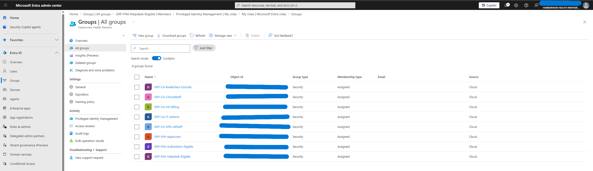 | PIM-related groups created for eligible users and approvers |
| 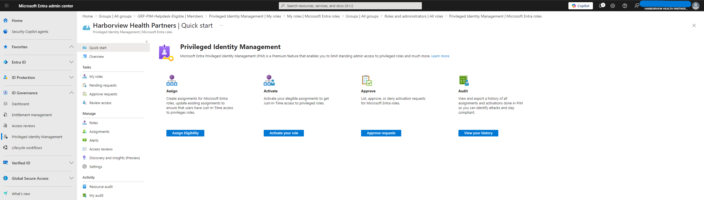 | Microsoft Entra roles opened in Privileged Identity Management |
| 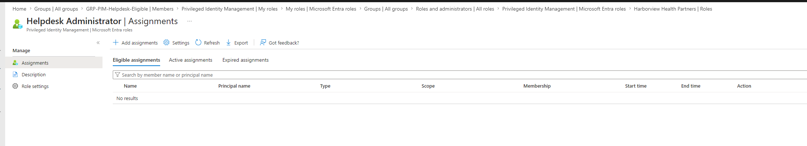 | Helpdesk Administrator role opened in PIM |
| 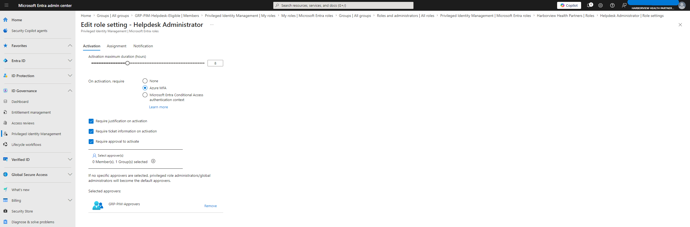 | Helpdesk Administrator settings requiring MFA, justification, ticket information, and approval |
| 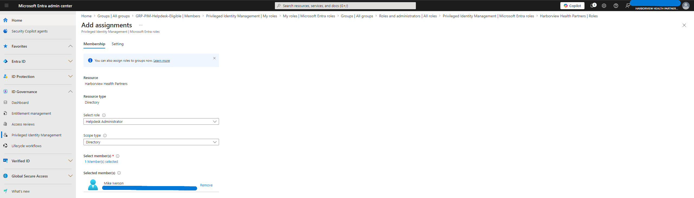 | Mike Iverson selected for Helpdesk Administrator assignment |
| 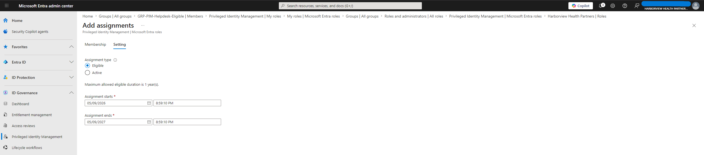 | Helpdesk Administrator assignment configured as eligible |
| 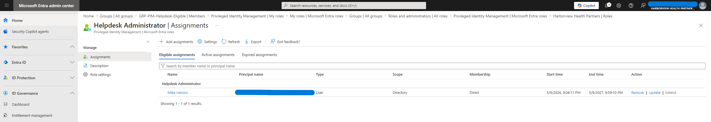 | Mike Iverson added as eligible for Helpdesk Administrator |
| 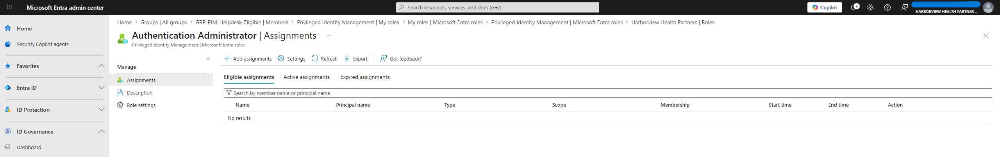 | Authentication Administrator role opened in PIM |
| 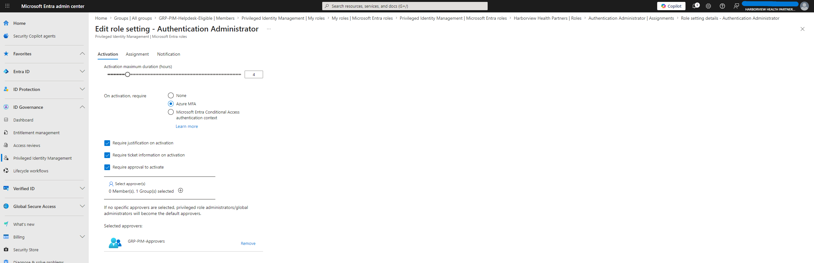 | Authentication Administrator activation settings configured |
| 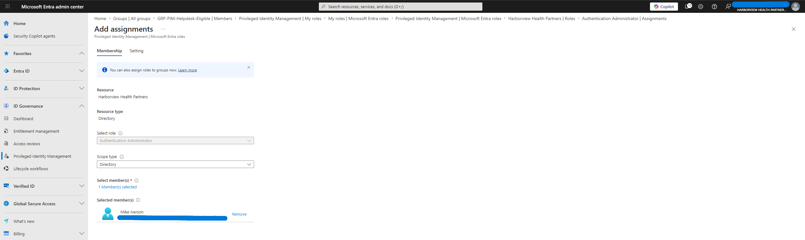 | Mike Iverson selected for Authentication Administrator assignment |
|  | Authentication Administrator assignment configured as eligible |
| 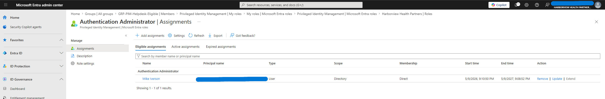 | Mike Iverson added as eligible for Authentication Administrator |
| 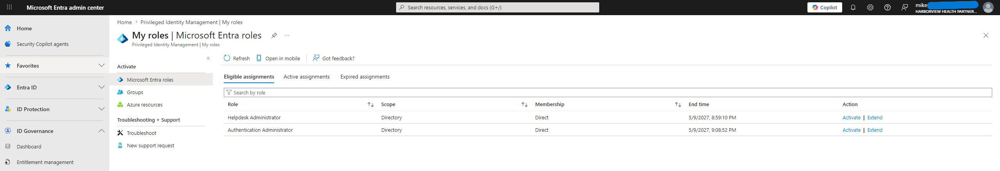 | Mike Iverson viewing eligible PIM roles |
| 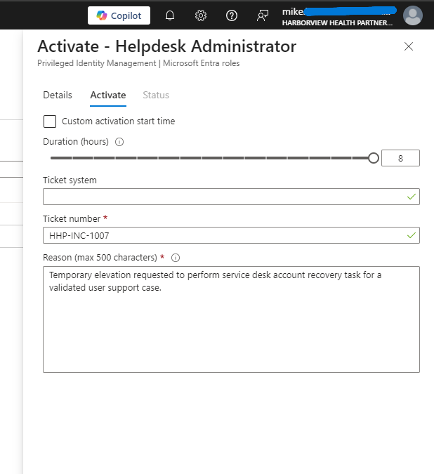 | Helpdesk Administrator activation request with justification and ticket information |
| 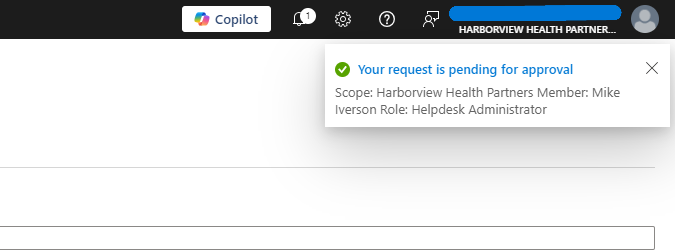 | Activation request pending approval |
| 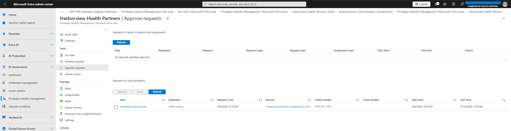 | Approver view showing Mike Iverson's pending PIM activation request |
| 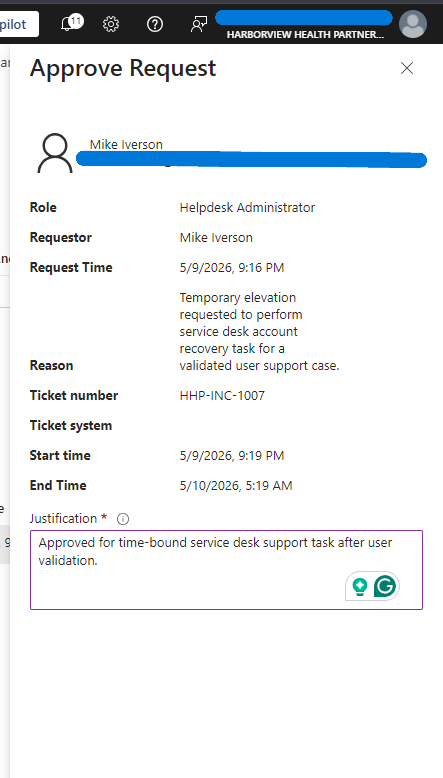 | PIM approval request approved |
| 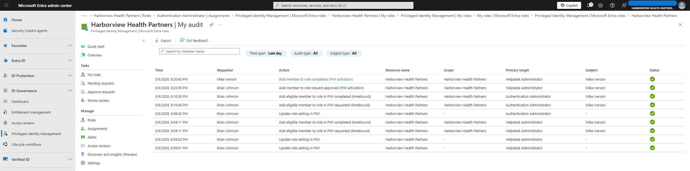 | PIM audit log showing approval and activation success |
| 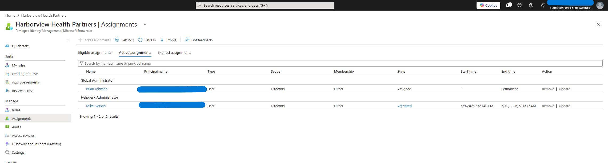 | Helpdesk Administrator role shown as activated for Mike Iverson |
| 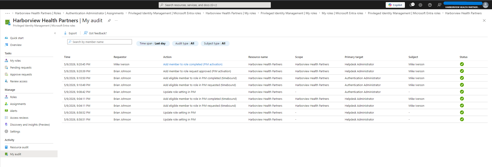 | Final PIM audit history showing assignment, approval, and activation events |

---
 
## Notes
 
This lab was completed in a Microsoft Entra ID P2 trial tenant using a simulated healthcare organization. The lab was designed to demonstrate the security value of just-in-time privileged access, not to grant broad permanent administrative access.
 
---
 
## Sanitization Notice
 
This lab was completed in a Microsoft Entra ID P2 trial tenant using a fictional healthcare organization (Harborview Health Partners). All users, groups, ticket numbers, and configuration details are invented for demonstration purposes. All screenshots were sanitized before publication: tenant IDs, personal identifiers, full user principal names, and other unnecessary internal identifiers were redacted.
